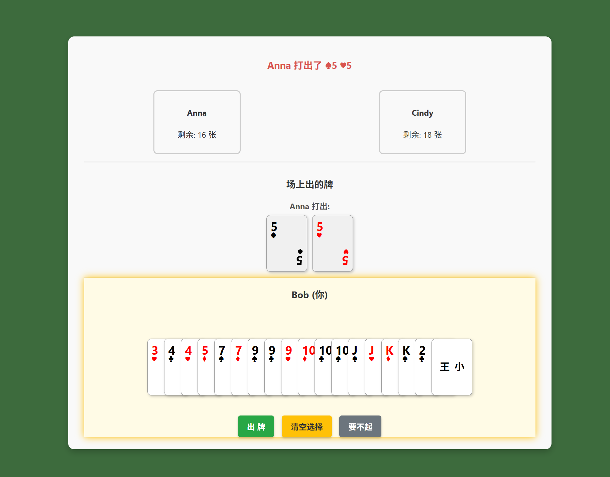

# 局域网实时跑得快 NetPDK - A Real-time LAN Multiplayer Card Game


这是一个基于Python Flask和Socket.IO构建的网页版“跑得快”扑克牌游戏。它允许多个用户在同一个局域网（LAN）下，通过浏览器访问同一个IP地址，进行实时的多人对战。

This is a web-based, real-time multiplayer "Pǎo De Kuài" (Run Fast) card game built with Python Flask and Socket.IO. It allows multiple users on the same Local Area Network (LAN) to play against each other by accessing a shared IP address in their browsers.

## 游戏截图 (Screenshot)



## 主要功能 (Features)

- **实时多人对战**: 基于WebSocket (Socket.IO) 实现，所有玩家操作即时同步。
- **游戏大厅系统**: 玩家可以输入昵称加入游戏，房主可以控制游戏开始。
- **丰富的牌型逻辑**: 服务器端自动验证出牌规则，支持以下牌型：
    - **单张、对子、三张**
    - **三带一、三带二**
    - **顺子、连对**
    - **飞机（带单翼或对翼）**
    - **炸弹、四带二**
    - **大小王（Jokers）** 与 **火箭（王炸）**
- **动态游戏界面**:
    - 前端实时渲染手牌、其他玩家状态和桌面上的牌。
    - 优化的手牌UI，即使牌多重叠也能看清数字。
    - 智能的桌面布局，长顺子等牌型可自动换行显示，不会撑破页面。
- **清晰的玩家轮次指示**: 高亮当前出牌玩家，操作提示清晰。
- **完整的游戏流程**: 从发牌、轮流出牌、过牌（要不起）到判断最终胜利者。
- **跨平台**: 任何有现代浏览器的设备（电脑、平板、手机）均可参与。

## 技术栈 (Technology Stack)

- **后端 (Backend)**: Python 3
    - **Web框架**: Flask
    - **实时通讯**: Flask-SocketIO
- **前端 (Frontend)**:
    - **结构**: HTML5
    - **样式**: CSS3 (Flexbox)
    - **逻辑**: JavaScript (ES6)
- **核心依赖**: 详见 `requirements.txt`

## 安装与使用 (Installation & Usage)

请确保您的电脑已安装 Python 3 和 pip。

1.  **克隆仓库**
    ```bash
    git clone https://github.com/your-username/NetPDK.git
    cd NetPDK
    ```

2.  **创建并激活虚拟环境 (推荐)**
    - **Windows**:
      ```bash
      python -m venv venv
      .\venv\Scripts\activate
      ```
    - **macOS / Linux**:
      ```bash
      python3 -m venv venv
      source venv/bin/activate
      ```

3.  **安装依赖**
    ```bash
    pip install -r requirements.txt
    ```

4.  **运行服务器**
    ```bash
    python app.py
    ```
    服务器启动后，您会看到类似 `* Running on http://0.0.0.0:5000` 的输出。

5.  **开始游戏**
    - 首先，获取运行服务器的电脑在局域网中的IP地址。一般情况下，运行程序后，IP地址会显示在终端中。
    - 局域网内的所有玩家，在各自的浏览器中访问 `http://<你的局域网IP>:5000` (例如: `http://192.168.1.108:5000`)。
    - 输入昵称，加入游戏，开始你们的游戏吧！

## 已知问题 (Known Issues)
- 一局游戏结束后进入下一句，上一局最后的牌会显示在牌桌上。
- 昵称输入界面显示可能异常。
- 移动端优化不足，在一些设备上可能会显示异常。