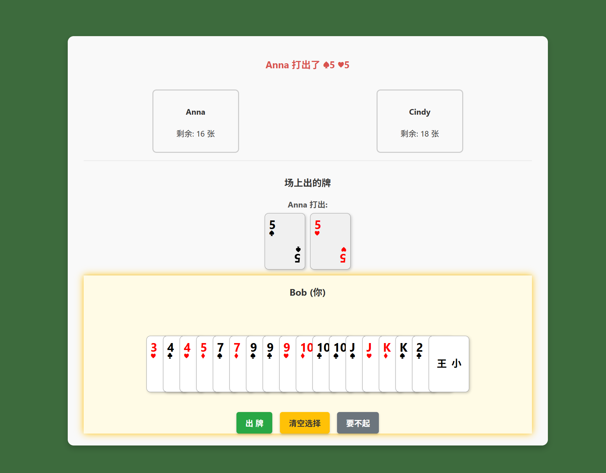

# NetPDK：局域网实时跑得快（Flask + Socket.IO）


NetPDK 是一个基于 **Python Flask + Flask-SocketIO** 的网页多人跑得快项目，支持：
- 局域网多人实时对战；
- 人机混战（可动态添加机器人）；
- 多种规则配置（副牌数、是否带王、是否允许王炸/四带二/飞机带翼等）。

项目目标是：**开箱即玩、部署简单、规则可扩展、交互实时稳定**。

---

## 项目亮点

- **低门槛联机**：只需一台机器开服，局域网内通过浏览器访问同一 URL 即可同局对战。
- **服务端裁决**：牌型识别、合法性校验、轮次推进全部在服务端执行，避免前端作弊。
- **实时同步**：基于 Socket.IO 推送大厅与对局状态，延迟低、交互反馈快。
- **机器人玩家**：内置启发式 AI，可进行跟牌分析、炸弹决策与阶段性打法调整。
- **规则可配置**：支持不同预设规则组合，方便休闲玩法与竞技玩法切换。

## 游戏截图



---

## 核心功能清单

### 1) 大厅与房间
- 玩家输入昵称加入房间。
- 房主可调整房间规则并开始游戏。
- 支持动态添加机器人补位。
- 房主身份始终保持为在线真人玩家（避免机器人成为房主）。

### 2) 对局流程
- 发牌 -> 轮流出牌 -> 跟牌/过牌 -> 结算胜者。
- 当前行动玩家高亮提示，避免错过轮次。
- 对手仅展示剩余牌数，保护信息公平。

### 3) 牌型与规则支持
- 基础牌型：单张、对子、三张。
- 扩展牌型：三带一、三带二、顺子、连对、飞机（及带翼）、炸弹、四带二。
- 特殊牌：小王/大王、王炸（可配置启用/禁用）。

### 4) 机器人能力（当前版本）
- 手牌结构分析：拆分顺子/连对/三条/炸弹并评估可行出牌。
- 跟牌构造增强：可构造三带一、三带二进行响应。
- 对局阶段意识：开局/中局/残局使用不同出牌偏好。
- 抢权策略：在对手临近出完时提高炸弹使用倾向。

---

## 技术架构

- **后端**：Python 3 + Flask + Flask-SocketIO
- **前端**：HTML/CSS/JavaScript（原生）
- **核心模块**：
  - `app.py`：Socket 事件与对局广播控制
  - `game_logic.py`：牌型判定、合法性校验、轮次推进
  - `ai_logic.py`：机器人策略与决策引擎
  - `static/js/main.js`：前端大厅/牌桌渲染与交互

---

## 快速开始

### 环境要求
- Python 3.8+
- pip

### 安装步骤

1. 克隆仓库
```bash
git clone https://github.com/your-username/NetPDK.git
cd NetPDK
```

2. 创建虚拟环境（推荐）
```bash
python -m venv venv
source venv/bin/activate
```

Windows:
```bash
.\venv\Scripts\activate
```

3. 安装依赖
```bash
pip install -r requirements.txt
```

4. 启动服务
```bash
python app.py
```

5. 局域网访问
- 在服务端终端确认监听地址（默认 `0.0.0.0:5000`）。
- 局域网玩家访问：`http://<服务器局域网IP>:5000`

---

## 规则配置说明

当前支持的房间参数包括：
- 副牌数：`1 ~ 6`
- 规则预设：`classic` / `full` / `strict`
- 预设影响：是否带王、是否允许王炸、是否允许飞机带翼、是否允许四带二

建议：
- 休闲局使用 `full`；
- 偏竞技局可使用 `strict`；
- 多人娱乐可提高副牌数增强局面复杂度。

---

## 已知问题（Known Issues）

1. **对局结束后的状态复位仍有优化空间**：个别场景下上一局信息残留在 UI 上的风险仍存在。
2. **移动端适配不完整**：在小屏设备上，卡牌重叠和操作热区体验仍需优化。
3. **AI 策略仍偏启发式**：在极端牌型和长局博弈中，尚未达到“稳定压制高水平真人”效果。
4. **缺少完整自动化测试**：当前以手工联调与基础脚本检查为主，回归测试覆盖不足。

---

## TODO List

### 高优先级
- [ ] 增加完整对局状态机与重置机制，彻底消除残局状态残留。
- [ ] 建立单元测试（牌型判定/合法性校验）与集成测试（Socket 对局流程）。
- [ ] 优化移动端交互（手牌选中、滚动、按钮布局和横竖屏适配）。

### 中优先级
- [ ] 引入 AI 对手行为记忆（出牌历史、剩余高牌概率）与更强残局求解。
- [ ] 增加“再来一局”与玩家准备状态机制，优化连续开局体验。
- [ ] 增加观战模式与回放日志（用于复盘和调参）。

### 低优先级
- [ ] 增加多主题皮肤与可配置动画。
- [ ] 支持基础战绩统计（胜率、平均回合数、常用牌型）。

---

## 许可证

本项目基于 MIT License 开源，详见 `LICENSE`。
